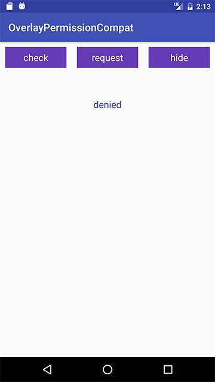
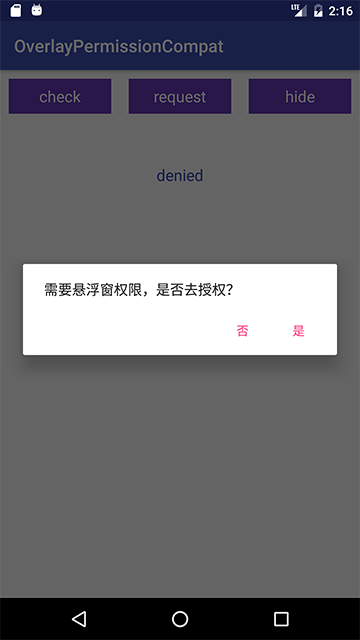
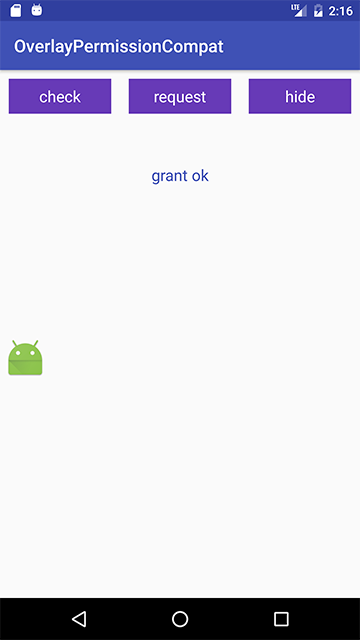

# OverlayPermissionCompat [](https://jitpack.io/#czy1121/overlaypermission)
 
悬浮窗权限兼容库

悬浮窗权限是特殊权限(Special Permissions)需要在manifest中申请并且通过发送Intent让用户在设置界面进行勾选

**检测**

API 23+(Android 6.0+/M) 使用 `Settings.canDrawOverlays`

API 19+(Android 4.4+/Kitkat) 通过反射使用 `AppOpsManager.checkOp`

API < 19 时始终返回 true
 
**授权**

当未授权时需要用户去设置页开启授权

API 23+(Android 6.0+/M) 去系统设置面板就好 `new Intent(Settings.ACTION_MANAGE_OVERLAY_PERMISSION)`

API 19+(Android 4.4+/Kitkat) 默认权限开启，有些Rom会默认禁用权限，需要检测各Rom类型然后跳转到对应的设置页面

API < 19 时不做任何处理


**参考**

Android 悬浮窗权限各机型各系统适配大全   
http://blog.csdn.net/self_study/article/details/52859790    
https://github.com/zhaozepeng/FloatWindowPermission

Android M 权限最佳实践
http://chen-wei.me/2016/11/10/android-permission-best-practice/

Android 权限管理 —— AppOps   
http://3dobe.com/archives/51/

Android 4.3 隐藏功能 App Ops 分析   
https://mssun.me/blog/android-4-3-app-ops-analysis.html
  
http://androidxref.com/4.3_r2.1/xref/frameworks/base/core/java/android/app/AppOpsManager.java

  

## Gradle

``` groovy
repositories { 
    maven { url "https://jitpack.io" }
} 
dependencies {
    compile 'com.github.czy1121:overlaypermission:1.0.1'
}
```
    
## Usage

``` java 
if (OverlayPermissionCompat.check(this)) {   
    // granted
} else {
    // denied 
    // 询问是否去设置权限
    OverlayPermissionCompat.inquire(this);
}
```

API 23+ 用户开启权限后可收到结果

``` java
@Override
protected void onActivityResult(int requestCode, int resultCode, Intent data) {
    super.onActivityResult(requestCode, resultCode, data); 
    if (OverlayPermissionCompat.isGranted(this, requestCode)) { 
        // grant success
    }
}
```


## License

```
Copyright 2016 czy1121

Licensed under the Apache License, Version 2.0 (the "License");
you may not use this file except in compliance with the License.
You may obtain a copy of the License at

   http://www.apache.org/licenses/LICENSE-2.0

Unless required by applicable law or agreed to in writing, software
distributed under the License is distributed on an "AS IS" BASIS,
WITHOUT WARRANTIES OR CONDITIONS OF ANY KIND, either express or implied.
See the License for the specific language governing permissions and
limitations under the License.
```