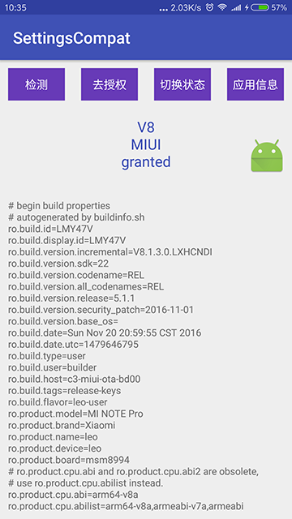

# SettingsCompat [](https://jitpack.io/#czy1121/settingscompat)
 
特殊权限(Special Permissions)兼容库，悬浮窗权限(SYSTEM_ALERT_WINDOW)与系统设置修改权限(WRITE_SETTINGS)

Android 6.0以前只要在manifest中申请了权限就是默认开启的 
Android 6.0+需要在manifest中申请并且通过发送Intent让用户在设置界面进行勾选  

## 适配

**检测**

- API 23+(Android 6.0+/M) 使用 `Settings.canDrawOverlays`, `Settings.System.canWrite`
- API 18+(Android 4.3+/JellyBean MR2) 通过反射使用 `AppOpsManager.checkOp`
- API < 18 默认权限开启，时始终返回 true
 
**授权** 

- API 23+(Android 6.0+/M) 去系统设置面板就好 `new Intent(Settings.ACTION_MANAGE_OVERLAY_PERMISSION)`, `new Intent(Settings.ACTION_MANAGE_WRITE_SETTINGS)` 
- API 18+(Android 4.3+/JellyBean MR2) 默认权限开启 
- API < 18 默认权限开启，不做任何处理

**切换授权状态**

`AppOpsManager.setMode` 可用于`Android 4.3/4.4`修改授权状态

API 18 添加AppOpsManager(被隐藏，在Android 4.4公开)
API 21 后需要签名验证的权限`android.Manifest.permission.UPDATE_APP_OPS_STATS`，第三方应用用不了了。

**ROM**

有些Rom会默认禁用权限，通常都有自带的权限管理

API 18+ 有些Rom会默认禁用权限，通常都有自带的权限管理，这时就需要检测Rom类型然后跳转到对应的设置页面

API 23+ 本来去系统设置面板就好了，但有些Rom会用自带的权限管理替代系统设置面板，这时仍然需要检测Rom类型然后跳转到对应的设置页面
 
实际上是跳转到手机上的安全中心里对应的权限设置页，当安全中心版本不同时相应的权限设置页也有可能不一样

还有部分ROM的应用详细信息页可以设置权限
 
## 测试 

   
主要是测了悬浮窗权限    

|设备|系统版本|ROM版本|状态|跳转|
|---|---|---|---|
|华为 荣耀7i|6.0.1|4.0|默认禁用|ok|
|华为 荣耀畅玩5X|5.1.1|4.0.1|默认禁用|ok|
|华为 Ascend P7|5.1.1|3.1|默认禁用|ok |
|华为 荣耀6|5.1.1|3.1|默认禁用|ok|
|华为 畅享5S|5.1|3.0|默认禁用|ok|
|华为 P8|5.0.1|3.1|默认可用|ok,无`安全中心`| 
|小米 MI 5|6.0|V7|默认禁用|ok|
|小米 Note Pro|5.1.1|V8|默认禁用|ok|
|小米 红米 Pro|6.0|V8|默认禁用|ok|
|小米 红米1S|4.4.2|V7|默认禁用|ok|
|魅族 Pro5|5.1|5.1.11|默认禁用|ok| 
|魅族 MX4|5.1|5.1.5|默认禁用|ok|
|魅族 魅蓝Note2|5.1|5.1.5|默认禁用|ok|
|魅族 M1|4.4.4|4.2.1|默认可用|ok，悬浮窗不能覆盖到其它应用上，详情页有悬浮窗权限设置，禁用后无影响|
|锤子 坚果|5.1.1|2.5.3|默认禁用|fail，到达悬浮窗管理页，但随后奔溃|
|锤子 坚果|4.4.4|2.1.2|默认禁用|ok|
|OPPO A53|5.1.1|2.1|默认可用|ok| 
|OPPO R7s|4.4.4|2.1|默认可用|ok|
|VIVO X6S Plus|5.1.1|2.5|默认可用|到达`i管家`主页，未到悬浮窗管理页|
|VIVO X6|5.1|2.5|默认可用|到达`i管家`主页，未到悬浮窗管理页|
|VIVO X5|5.0|2.5|默认可用|到达`i管家`主页，未到悬浮窗管理页|
|VIVO X5M|5.0.2|2.0|默认可用|ok, `i管家`没有悬浮窗管理功能|
|VIVO Y23L|4.4.4|1.5|默认可用|ok, `i管家`没有悬浮窗管理功能|
|三星 Galaxy S6|6.0.1|/|默认可用|ok|
|三星 Galaxy Note4|6.0.1|/|默认可用|ok|
|摩托罗拉 X Style|5.1.1|/|默认可用|ok|
|联想 乐檬3|5.1.1|/|默认可用|ok|
|酷派 锋尚 pro|4.4.4|/|默认可用|ok|
|金立 F103|5.0|/|默认可用|ok|
|乐视 乐 Max|6.0.1|/|默认可用|ok|
 
百度云真机
http://mtc.baidu.com/tinypace/main#/?from=DaoHang

腾讯优测真机
http://remote.utest.qq.com/deviceSearch?type=remote

 
 

## Gradle

``` groovy
repositories { 
    maven { url "https://jitpack.io" }
} 
dependencies {
    compile 'com.github.czy1121:settingscompat:1.1.0'
}
```
    
## API

``` java 
// 检测是否授权
SettingsCompat.canDrawOverlays(Context)
SettingsCompat.canWriteSettings(Context)

// 设置授权状态，仅在未深度定制的 Android 4.3/4.4 上可用
SettingsCompat.setDrawOverlays(Context, boolean)
SettingsCompat.setWriteSettings(Context, boolean)

// 跳转到悬浮窗权限设置页
SettingsCompat.manageDrawOverlays(Context)
// 跳转到系统设置修改权限设置页，暂时只支持 Android 6.0+
SettingsCompat.manageWriteSettings(Context)
```
 
## 参考

Android 悬浮窗权限各机型各系统适配大全   
http://blog.csdn.net/self_study/article/details/52859790    
https://github.com/zhaozepeng/FloatWindowPermission

Android M 权限最佳实践  
http://chen-wei.me/2016/11/10/android-permission-best-practice/

Android 权限管理 —— AppOps   
http://3dobe.com/archives/51/

Android 4.3 隐藏功能 App Ops 分析   
https://mssun.me/blog/android-4-3-app-ops-analysis.html
  
http://androidxref.com/4.3_r2.1/xref/frameworks/base/core/java/android/app/AppOpsManager.java


## License

```
Copyright 2016 czy1121

Licensed under the Apache License, Version 2.0 (the "License");
you may not use this file except in compliance with the License.
You may obtain a copy of the License at

   http://www.apache.org/licenses/LICENSE-2.0

Unless required by applicable law or agreed to in writing, software
distributed under the License is distributed on an "AS IS" BASIS,
WITHOUT WARRANTIES OR CONDITIONS OF ANY KIND, either express or implied.
See the License for the specific language governing permissions and
limitations under the License.
```
  